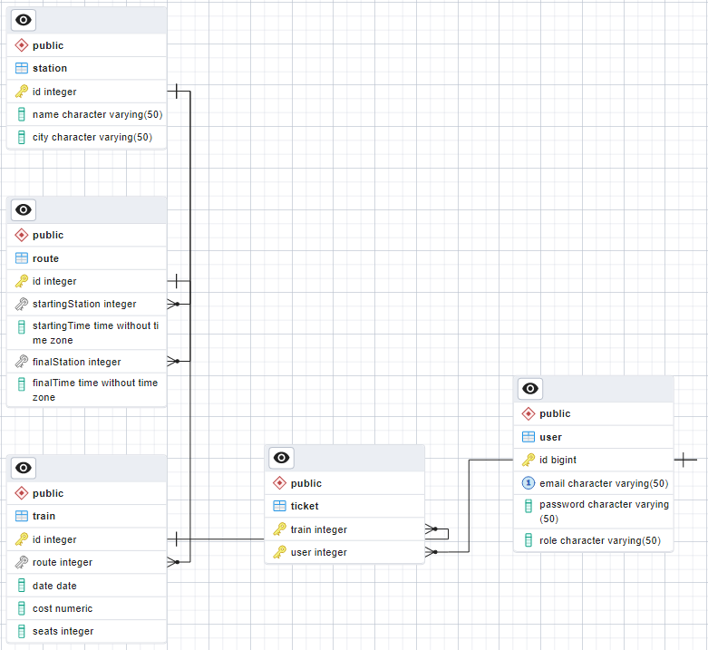

#Railway ticket office

##Description

The administrator can add / delete / edit the list of Stations and Railway Routes between them. The route contains information as:
- starting station and departure time;
- final station and time of arrival.

The user can search for routes between stations that interest him. The result of the search is a list of trains, each string of which contains:
- train number;
- time / date and station of departure;
- travel time;
- time / date and station of arrival;
- number of available seats;
- travel cost;
- link to the corresponding route view page (user can view route information).

If the user is registered in the system, he must be able to buy a ticket for the selected route on the specified date (subject to availability).

Application is developed using java core and PostgreSQl. It support both english and ukrainian languages and interface. During development was implemented such programming patterns: Command, Factory, Singleton and Front-controller. App uses jsp and tomcat as servlet container. Raillway ticket office is a servlet app that uses Servlet filters and session. Also this web aplication implements autentification and autorization. All dao methods and service classes are covered by unit tests. All data lists has thair own pagination.

##PostgreSQL set up

Use this script to create DB:

```
CREATE DATABASE "testRailway"
    WITH
    OWNER = postgres
    ENCODING = 'UTF8'
    LC_COLLATE = 'Russian_Russia.1251'
    LC_CTYPE = 'Russian_Russia.1251'
    TABLESPACE = pg_default
    CONNECTION LIMIT = -1
    IS_TEMPLATE = False;
```

And this one to ctrate tebles and insert admin user:

```
BEGIN;

CREATE TABLE IF NOT EXISTS public.route
(
    id bigserial NOT NULL,
    "startingStation" integer NOT NULL,
    "startingTime" time without time zone NOT NULL,
    "finalStation" integer NOT NULL,
    "finalTime" time without time zone NOT NULL,
    CONSTRAINT route_pkey PRIMARY KEY (id)
);

CREATE TABLE IF NOT EXISTS public.station
(
    id bigserial NOT NULL,
    name character varying(50) COLLATE pg_catalog."default" NOT NULL,
    city character varying(50) COLLATE pg_catalog."default" NOT NULL,
    CONSTRAINT station_pkey PRIMARY KEY (id)
);

CREATE TABLE IF NOT EXISTS public.ticket
(
    train integer NOT NULL,
    "user" integer NOT NULL,
    CONSTRAINT ticket_pkey PRIMARY KEY ("user", train)
);

CREATE TABLE IF NOT EXISTS public.train
(
    id bigserial NOT NULL,
    route integer NOT NULL,
    date date NOT NULL,
    cost numeric NOT NULL,
    seats integer NOT NULL DEFAULT 200,
    CONSTRAINT train_pkey PRIMARY KEY (id)
);

CREATE TABLE IF NOT EXISTS public."user"
(
    id bigserial NOT NULL,
    email character varying(50) COLLATE pg_catalog."default" NOT NULL,
    password character varying(50) COLLATE pg_catalog."default" NOT NULL,
    role character varying(50) COLLATE pg_catalog."default" NOT NULL DEFAULT 'customer'::character varying,
    CONSTRAINT user_pkey PRIMARY KEY (id),
    CONSTRAINT unique_email UNIQUE (email)
);

ALTER TABLE IF EXISTS public.route
    ADD CONSTRAINT "route_finalStation_fkey" FOREIGN KEY ("finalStation")
    REFERENCES public.station (id) MATCH SIMPLE
    ON UPDATE CASCADE
    ON DELETE CASCADE
    NOT VALID;


ALTER TABLE IF EXISTS public.route
    ADD CONSTRAINT "route_startingStation_fkey" FOREIGN KEY ("startingStation")
    REFERENCES public.station (id) MATCH SIMPLE
    ON UPDATE CASCADE
    ON DELETE CASCADE
    NOT VALID;


ALTER TABLE IF EXISTS public.ticket
    ADD CONSTRAINT ticket_train_fkey FOREIGN KEY (train)
    REFERENCES public.train (id) MATCH SIMPLE
    ON UPDATE NO ACTION
    ON DELETE NO ACTION
    NOT VALID;


ALTER TABLE IF EXISTS public.ticket
    ADD CONSTRAINT ticket_user_fkey FOREIGN KEY ("user")
    REFERENCES public."user" (id) MATCH SIMPLE
    ON UPDATE NO ACTION
    ON DELETE NO ACTION
    NOT VALID;


ALTER TABLE IF EXISTS public.train
    ADD CONSTRAINT train_route_fkey FOREIGN KEY (route)
    REFERENCES public.route (id) MATCH SIMPLE
    ON UPDATE CASCADE
    ON DELETE CASCADE
    NOT VALID;


INSERT INTO "user" (email, password, role)
	VALUES('admin@railway.com', 'admin', 'admin');
	
	
END;
```

In the end you will get this:



##Structure

Simple MVC Controller:

```
package controller;

import java.io.IOException;

import javax.servlet.ServletException;
import javax.servlet.annotation.WebServlet;
import javax.servlet.http.HttpServlet;
import javax.servlet.http.HttpServletRequest;
import javax.servlet.http.HttpServletResponse;

import actions.Action;
import actions.ActionFactory;

@WebServlet({"/controller", ""})
public class Controller extends HttpServlet {
    
    private static final ActionFactory ACTION_FACTORY = ActionFactory.geActionFactory();

    @Override
    protected void doGet(HttpServletRequest req, HttpServletResponse resp) throws ServletException, IOException {
        req.getRequestDispatcher(process(req)).forward(req, resp);
    }
    
    @Override
    protected void doPost(HttpServletRequest req, HttpServletResponse resp) throws ServletException, IOException {
        resp.sendRedirect(process(req));
    }
    
    private String process(HttpServletRequest req) {
        Action action = ACTION_FACTORY.createAction(req.getParameter("action"));
        String path;
        try {
            path = action.execute(req);
        } catch (Exception e) {
            e.printStackTrace();
            req.getSession().setAttribute("error", e.getMessage());
            path = "errorpage.jsp";
        }
        return path;
        
    }
}
```

That is using comand pattern called Action

Action.java

```
package actions;

import javax.servlet.http.HttpServletRequest;

import db.AbstractDAO;
import db.postgres.PostgresDAO;
import services.TrainService;
import services.UserService;

public interface Action {

    static AbstractDAO dao = PostgresDAO.getInstance();
    static UserService userService = new UserService(PostgresDAO.getInstance());
    static TrainService trainService = new TrainService(PostgresDAO.getInstance());
    
    /**
     * @param request
     * @return
     * @throws Exception
     */
    String execute(HttpServletRequest request) throws Exception;

}
```

Which has it's factory

ActionFactory.java

```
package actions;

import java.util.HashMap;
import java.util.Map;

import actions.implementation.AddRouteAction;
import actions.implementation.AddStationAction;
import actions.implementation.AddTrainAction;
import actions.implementation.ChangeLocaleAction;
import actions.implementation.DefaultAction;
import actions.implementation.GetRouteTrains;
import actions.implementation.LogInAction;
import actions.implementation.LogOutAction;
import actions.implementation.OrderAction;
import actions.implementation.SearchAction;
import actions.implementation.SignUpAction;
import actions.implementation.pagination.NextAction;
import actions.implementation.pagination.PrevAction;

public final class ActionFactory {
    
    private static final ActionFactory ACTION_FACTORY = new ActionFactory();
    private static final Map<String, Action> ACTION_MAP = new HashMap<>();

    static {
        ACTION_MAP.put("login",  new LogInAction());
        ACTION_MAP.put("logout",  new LogOutAction());
        ACTION_MAP.put("signup",  new SignUpAction());
        ACTION_MAP.put("changelocale",  new ChangeLocaleAction());
        ACTION_MAP.put("order",  new OrderAction());
        ACTION_MAP.put("addstation",  new AddStationAction());
        ACTION_MAP.put("addroute",  new AddRouteAction());
        ACTION_MAP.put("addtrain",  new AddTrainAction());
        ACTION_MAP.put("routetrains",  new GetRouteTrains());
        ACTION_MAP.put("prev",  new PrevAction());
        ACTION_MAP.put("next",  new NextAction());
        ACTION_MAP.put("search",  new SearchAction());

    }

    private ActionFactory() {}

    public static ActionFactory geActionFactory() { return ACTION_FACTORY;}

    public Action createAction(String actionName) {
        return ACTION_MAP.getOrDefault(actionName, new DefaultAction());
    }
}
```
